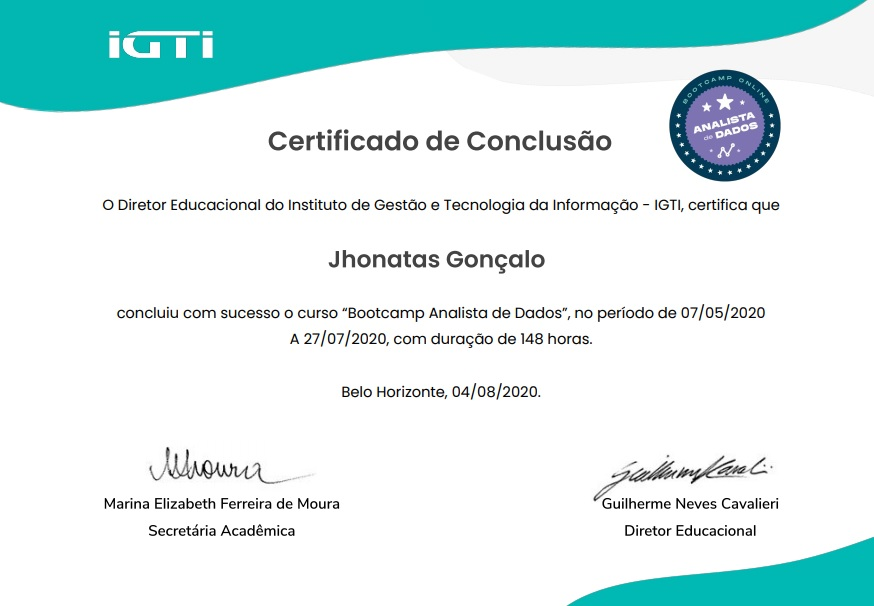

# Bootcamp Data Analyst - IGTI

IGTI was considered one of the 3 most innovative companies in the use of IT in Brazil by the IT Forum, in the Education category. [Link](https://itforum365.com.br/conheca-os-vencedores-categoria-do-premio-as-100-inovadoras-no-uso-de-ti-2019/)

Approximately 500 scholarships for bootcamps were made available (in April 2020) to students who passed a basic programming logic test. I was one of them!

The choice of this Bootcamp for data analysis aimed to learn important tools especially when it comes to Big Data.

The course modules are respectively:

[Fundamentals](https://github.com/jgoncsilva/IGTI-Bootcamp---Data-Analysis/tree/master/Fundamentals%20-%20Module%201) 

[Data processing using Hadoop ecosystem](https://github.com/jgoncsilva/IGTI-Bootcamp---Data-Analysis/tree/master/Hadoop%20%20-%20Module%202)

Files : [HERE](https://drive.google.com/drive/u/5/folders/1cNMqry11xrtr-z7rqzuCI7msmu7OOksN) 

[Data Collection -Webscrapping](https://github.com/jgoncsilva/IGTI-Bootcamp---Data-Analysis/tree/master/Data%20Collect%20-%20Module%203)

[Processing Techiques for Big Data - **PySpark**](https://github.com/jgoncsilva/IGTI-Bootcamp----Big-Data-Analysis/tree/master/Processing%20Techiques%20for%20Big%20Data)

It was a great experience to get to know the processing of large amounts of data, as well as tools such as KNIME for ETL, and NoSQL databases.

Below the certificate obtained at the end of the bootcamp:
---

